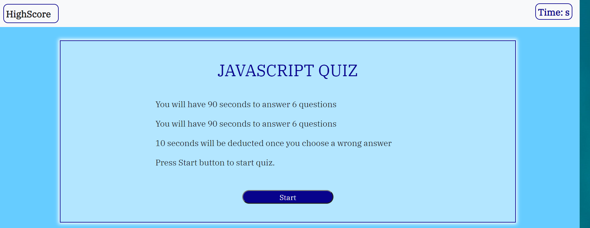
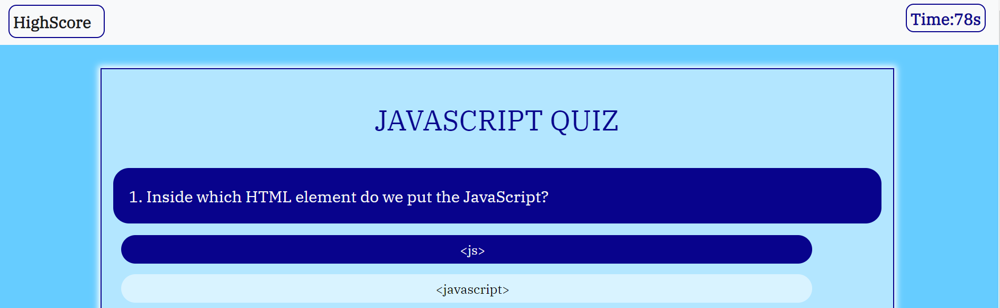

# code_quiz
A online quiz application idea
Project Overview
The URL of deployed application/site is https://miao0007.github.io/code_quiz/
The aim is to simulate a online quiz application, which looks like this:

After click start button, the quiz is started and the timer start counting down

After all six question be completed, a high score board displayed.

High score board can store and display scores from high to low, you can empty them by click clear button.
The further aim is to build more various questions like text area, multi option questions, and create back button that can let user redo the previous questions. 
In this project, I basicly used javascript, DOM and a few JQuery syntax to .js files
